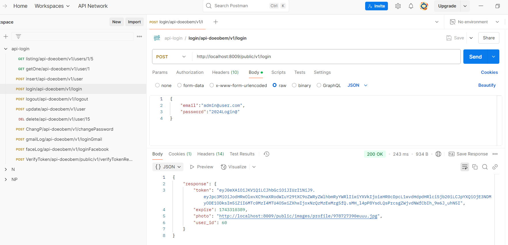

This is a micro-service API to login, login with another accounts, register, update profile, change password, etc. With PHP, Docker, SLIM 3, Composer, JWT security and CRUD for your new models, you can use Postman for test this API.

---------------------------------------------------------------------------------------------



Run by Docker : 

Clone the project :

```
git clone https://github.com/hedreiandrade/api-doeobem.git
```

Inside your project api-doeobem, run :

```
docker-compose up -d --build
```

Run the attached sql file(dblLoginAPI.sql) inside mysql in container(mysqlslim).

Run ```composer update``` at the root of the project, inside the container(api-doeobem)

Create files and configure \api-doeobem\app\Config
- db.php
- jwt.php
- facebook.php
- google.php

Configure in app/Config/db.php :

	const DRIVER = 'mysql';
	const HOST = 'mysqlslim';
	const DATA_BASE = 'api-doeobem';
	const USER_NAME = 'root';
	const PASSWORD = '123';
	const CHARSET = 'utf8';
	const COLLATION = 'utf8_general_ci';

Test by Postman import the configuration(api-login.postman_collection.json) in attached

Login:

{
	"email":"admin@user.com",
	"password":"2024Login@"
}

---------------------------------------------------------------------------------------------

Run by Wamp64/Xampp/Linux :

Clone the project, run :

```
git clone https://github.com/hedreiandrade/api-doeobem.git 
```

Run ```composer update``` at the root of the project in your directory

Run the attached sql file(dblLoginAPI.sql).

Create files and configure \api-doeobem\app\Config
- db.php
- jwt.php
- facebook.php
- google.php

Test by Postman import the configuration(api-login.postman_collection.json) in attached

Login:

{
	"email":"admin@user.com",
	"password":"2024Login@"
}

---------------------------------------------------------------------------------------------

Now, run the projects: https://github.com/hedreiandrade/api-doeobem-feed | https://github.com/hedreiandrade/login_react_apidoeobem

---------------------------------------------------------------------------------------------

Enjoy.
